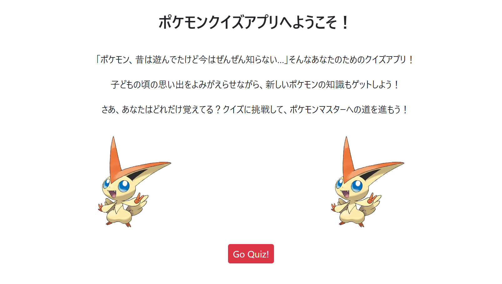
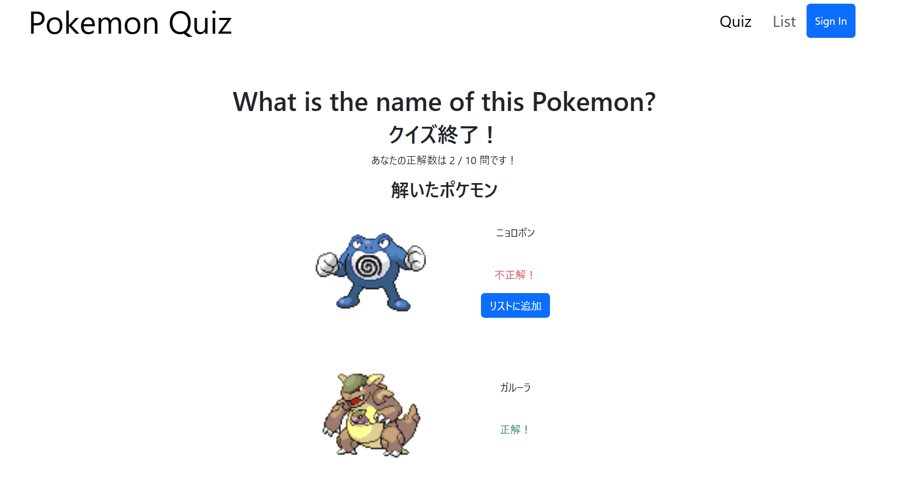
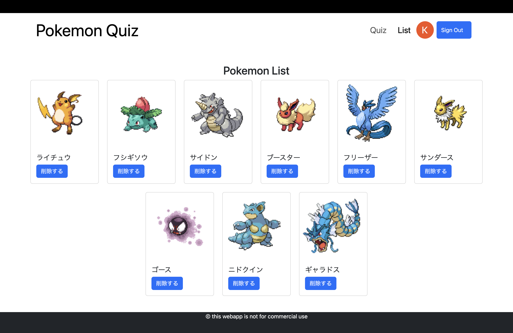

<h1>Pokemon Quiz</h1>

    <h2>App Overview</h2>
    

    

    This is the simple Pokemon quiz for children and adult who have played Pokemon, but don't remember pokemons a lot.
    In the Quiz section, you can take 10 questions for pokemon name. After doing all 10 question, you can check if it is correct or not. In addition, you can make a list to remember the pokemon. For now, you can list only the image and name. I will add some info like type. In terms of code, I used MVC and three tier architecture.
    

    
    
    

    <h2>Tech Stack</h2>
    <ul>
        <li>Languages: HTML, CSS, JavaScript, TypeScript</li>
        <li>Frameworks: Express, React, Bootstrap, React-Router</li>
        <li>Database: Firebase</li>
    </ul>

    <h2>How to install</h2>
    <ol>
        <li>git clone my git rep address</li>
        <li>move directory client/UI, server</li>
        <li>type npm install</li>
        <li>type npm run dev</li>
    </ol>

    <h2>Points of Improvement</h2>
    <ul>
        <li>Refactoring: hard to use code because of many function in one component in react</li>
        <li>Less comment</li>
    </ul>

<h3>deploy URL: https://poke-v456.vercel.app</h3>
